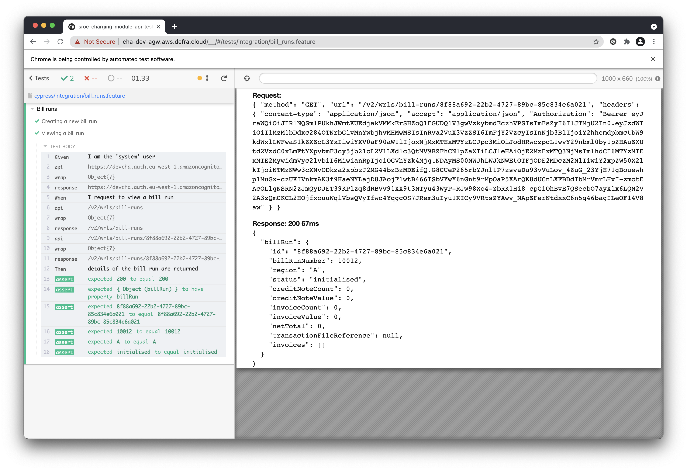
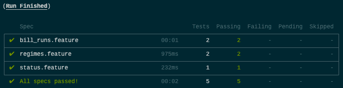

# SROC Charging Module API tests

> WIP replacement for [SROC Charging Module API Acceptance tests](https://github.com/DEFRA/sroc-cha-acceptance-tests)

This project contains API acceptance tests for the service. It is built using [Cypress](https://www.cypress.io/) and the [cypress-cucumber-preprocessor](https://github.com/TheBrainFamily/cypress-cucumber-preprocessor). We favour writing our tests in a [BDD style](https://cucumber.io/docs/bdd/) using [Gherkin](https://cucumber.io/docs/gherkin/) hence the cucumber-preprocessor plugin.

## Pre-requisites

You just need [Node.js](https://nodejs.org/en/) installed, ideally an LTS version.

You'll also need [Chrome](https://www.google.com/intl/en_uk/chrome/). It's what we use when working on the tests, and is one of 2 browsers available to our users.

## Installation

First clone the repository and then drop into your new local repo

```bash
git clone https://github.com/DEFRA/sroc-charging-module-api-tests.git && cd sroc-charging-module-api-tests
```

Next download and install the dependencies

```bash
npm install
```

## Configuration

> Important! Do not add environment files to source control

We have 6 environments where the CHA could be running; local, development, test, pre-production, integration, and production.

Each has its own config file stored in `environments/`. Any configuration shared across the environments is stored in `cypress.json`. But this can be overidden in the environment config files.

### Environment files

The config or 'environment' files hold environment variables which are key-value pairs; _name of the thing_ and the _value of the thing_. For example, `CYPRESS_ADMIN_USER=cognitoadminusername`.

Depending on the environment selected the [Cypress dotenv](https://github.com/morficus/cypress-dotenv) plugin will read in the values and make them available via [Cypress.env()](https://docs.cypress.io/api/cypress-api/env) in the tests.

Using these `.env` files allows us to store both config and credentials that change across environments in one place but it is important they are *_never_* committed to source control.

Checkout [environments/.env.example](/environments/.env.example) for an example of the file you'll need to create for each environment.

## Execution

You can run tests using the Cypress test runner or headlessly using the Cypress CLI.

### Test runner

> Cypress runs tests in a unique interactive runner that allows you to see commands as they execute while also viewing the application under test.



To open the test runner use `npm run cy:open:[env]` replacing `[env]` with your chosen environment

```bash
npm run cy:open:local
```

### CLI

> Runs Cypress tests to completion. By default, cypress run will run all tests headlessly in the Electron browser.



To open the test runner use `npm run cy:run:[env]` replacing `[env]` with your chosen environment

```bash
npm run cy:run:local
```

## Test structure

In order to test our environments as well as our application, we created a standalone project rather than install Cypress into an existing one.

We have also opted to write our tests as `features` using the BDD style. As such our project's structure is a little different from the common examples you'll find Googling.

### Features

Feature files (`*.feature`) need to be stored in `cypress/integration/` to be visible as tests. Along with each feature you will need to create a folder with the same name. In the folder create a `*.js` and add your steps for the feature there.

#### Steps

The [steps](https://cucumber.io/docs/cucumber/step-definitions/) file can be called anything. But we have opted to use the same name as the feature file and folder. This way makes it a little easier to track things when working across multiple files.

#### Common steps

Any steps which can be shared across features can be placed in `cypress/integration/common/`. Check the existing files to see if one that fits already exists and add your steps to it. Else create a new `*.js` file. Again, the name of the file does not matter.

### Endpoints

Another preference of the team is to use the [Page object pattern](https://martinfowler.com/bliki/PageObject.html). In a typical web app with a UI this would mean storing all the code to interact with a page in one place. As an API we don't have pages but we do have **endpoints**. Tests interact with our endpoint (page) object and not the endpoint directly. So, should something change, we only have to change it in one place.

Endpoints live in `cypress/endpoints`.

## Contributing to this project

If you have an idea you'd like to contribute please log an issue.

All contributions should be submitted via a pull request.

## Licence

THIS INFORMATION IS LICENSED UNDER THE CONDITIONS OF THE OPEN GOVERNMENT LICENCE found at:

<http://www.nationalarchives.gov.uk/doc/open-government-licence/version/3>

The following attribution statement MUST be cited in your products and applications when using this information.

> Contains public sector information licensed under the Open Government licence v3

### About the licence

The Open Government Licence (OGL) was developed by the Controller of Her Majesty's Stationery Office (HMSO) to enable information providers in the public sector to license the use and re-use of their information under a common open licence.

It is designed to encourage use and re-use of information freely and flexibly, with only a few conditions.
